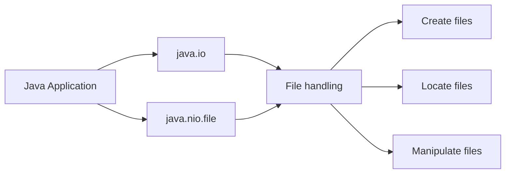
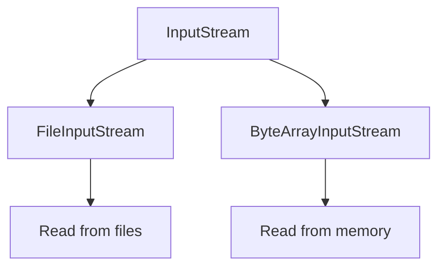
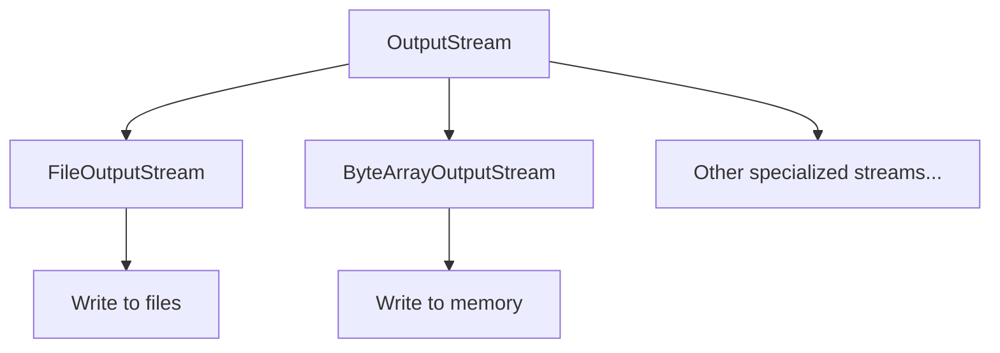
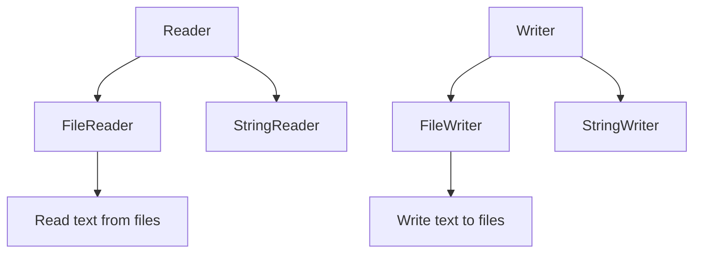
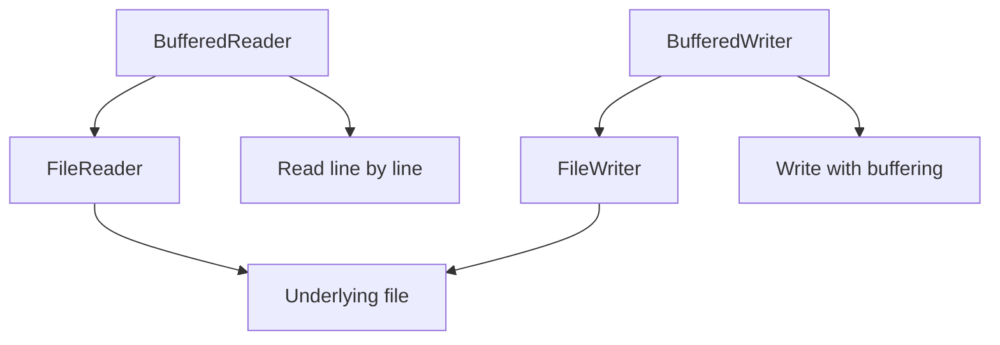
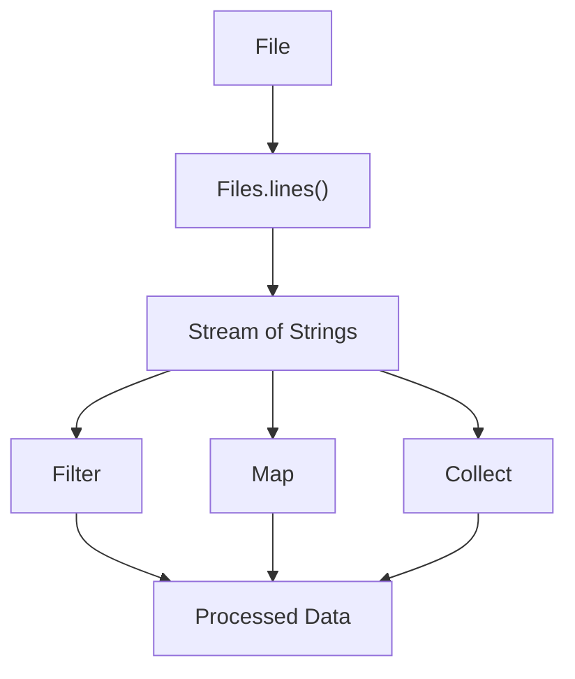

# Java I/O Lab

This lab introduces you to Java Input/Output (I/O) operations, covering file handling, reading, writing, and using streams.

---

## Agenda

1.  [Project Setup](#1-project-setup)
2.  [Creating and Locating Files](#2-creating-and-locating-files)
3.  [Reading with Input Streams](#3-reading-with-input-streams)
4.  [Writing with Output Streams](#4-writing-with-output-streams)
5.  [Character-based I/O with Readers and Writers](#5-character-based-io-with-readers-and-writers)
6.  [Buffered I/O Operations](#6-buffered-io-operations)
7.  [Introduction to File I/O with Streams](#7-introduction-to-file-io-with-streams)

---

## 1. Setup

Before you begin, create the necessary project structure:

1.  **Create a Package:** Inside the `src` folder, create a new package named `ie.atu.iolab`. This helps organise your code.
2.  **Create a `Main` Class:** Within the `ie.atu.iolab` package, create a new Java class named `Main`. This class will contain your `main` method.
3.  **Create a `resources` Folder:** *At the same level as your `src` folder* (i.e., in the project's root directory), create a new folder named `resources`. This is where you'll store text files used in the lab. **Important:** Do *not* create the `resources` folder inside the `src` folder.
4.  **Add a test print:** Add to the main method to ensure that your environment is setup:

    ```java
    package ie.atu.iolab;

    public class Main {
        public static void main(String[] args) {
            System.out.println("Java I/O Lab Setup Complete!");
        }
    }
    ```
5.  **Run the `Main` Class:** Run your `Main` class. You should see "Java I/O Lab Setup Complete!" printed in the console. This confirms your project is set up correctly.

---

## 2. Creating and Locating Files

### Concept Introduction: File Handling in Java

Java provides robust file handling capabilities through the `java.io` and `java.nio.file` packages. Understanding how to create, locate, and manipulate files is fundamental to I/O operations. The `java.nio.file` package (introduced in Java 7) offers a more modern and flexible approach.



### Explanation

In Java, you can create files programmatically or manually. The `Path` interface from `java.nio.file` is the modern way to represent file and directory pathnames. In this lab, we'll create a file manually and use Java to locate it. The `Files` class provides utility methods for interacting with files.

### Code Example

```java
package ie.atu.iolab;

import java.nio.file.Path;
import java.nio.file.Paths;
import java.nio.file.Files;

public class Main {
    public static void main(String[] args) {
        // Get the project's root directory
        Path projectRoot = Paths.get(System.getProperty("user.dir"));

        // Construct the path to input.txt within the resources folder
        Path inputFilePath = projectRoot.resolve("resources").resolve("input.txt");

        // Check if the file exists
        if (Files.exists(inputFilePath)) {
            System.out.println("input.txt found at: " + inputFilePath.toAbsolutePath());
        } else {
            System.out.println("input.txt not found at: " + inputFilePath.toAbsolutePath());
        }
    }
}
```

<details>
<summary>Expected Output (File Found)</summary>

```
input.txt found at: /path/to/your/project/JavaIOLab/resources/input.txt
```
*Note: The exact path will depend on your project location.*
</details>

<details>
<summary>Expected Output (File Not Found)</summary>

```
input.txt not found at: /path/to/your/project/JavaIOLab/resources/input.txt
```
*Note: The exact path will depend on your project location.*
</details>

### DIY Task

1.  **Create `input.txt`:** In the `resources` folder you created earlier, create a new text file named `input.txt`.
2.  **Add Content:** Open `input.txt` and type the following text: "Hello, Java I/O! This is a test file.", then save and close the file.
3.  **Run the Code:** Run the `Main` class. The output should show the absolute path to your `input.txt` file and confirm that it was found.
4.  **Verify Error Handling:** Temporarily *rename* `input.txt` to something else (e.g., `input_temp.txt`). Run the `Main` class again. The output should now indicate that `input.txt` was *not* found, demonstrating the error handling. Rename the file back to `input.txt` after testing.

---

## 3. Reading with Input Streams

### Concept Introduction: Input Streams

Input streams in Java are used to read data from a source, such as a file, network connection, or in-memory buffer. The base class for all byte-based input streams is `java.io.InputStream`. Input streams read data as *bytes*.



### Explanation

`FileInputStream` is a concrete implementation of `InputStream` used specifically for reading bytes from files. It's useful for reading binary data or when you need low-level control over reading operations. It reads data byte by byte.

### Code Example (using try-catch-finally)

```java
package ie.atu.iolab;

import java.io.FileInputStream;
import java.io.IOException;
import java.io.FileNotFoundException;

public class Main {
    public static void main(String[] args) {
        String filePath = "resources/input.txt";
        FileInputStream fis = null;

        try {
            fis = new FileInputStream(filePath);
            int data;
            int charCount = 0;
            // Read bytes until end of file (-1 indicates end of file)
            while ((data = fis.read()) != -1) {
                System.out.print((char) data); // Convert byte to character
                charCount++;
            }
            System.out.println("\nTotal characters: " + charCount);

        } catch (FileNotFoundException e) {
            System.err.println("File not found: " + e.getMessage());
        } catch (IOException e) {
            System.err.println("Error reading file: " + e.getMessage());
        } finally {
            try {
                if (fis != null) {
                    fis.close(); // Always close the stream
                }
            } catch (IOException e) {
                System.err.println("Error closing file: " + e.getMessage());
            }
        }
    }
}
```

<details>
<summary>Expected Output</summary>

```
Hello, Java I/O! This is a test file.
Total characters: 37
```
</details>

### DIY Task

1.  **Implement the Code:** Copy the provided code example into your `Main` class's `main` method, *replacing* the previous code.
2.  **Run and Observe:** Run the program. You should see the content of `input.txt` printed to the console, followed by the total number of characters.
3.  **Understand `fis.read()`:** Notice how `fis.read()` returns an `int`. This `int` represents the byte value (0-255) of the character read. We cast it to `char` to display the character.
4.  **Understand the `finally` Block:** The `finally` block ensures that the `FileInputStream` is closed, even if an exception occurs. This is crucial for releasing resources.

---

## 4. Writing with Output Streams

### Concept Introduction: Output Streams

Output streams in Java are used to write data to a destination, such as a file, network connection, or in-memory buffer. The base class for all byte-based output streams is `java.io.OutputStream`. Output streams write data as *bytes*.



### Explanation

`FileOutputStream` is a concrete implementation of `OutputStream` used for writing bytes to files. It can create a new file or append to an existing file. By default, it *overwrites* the file if it already exists.

### Code Example (introducing try-with-resources)

```java
package ie.atu.iolab;

import java.io.FileInputStream;
import java.io.FileOutputStream;
import java.io.IOException;

public class Main {
    public static void main(String[] args) {
        String inputPath = "resources/input.txt";
        String outputPath = "resources/output.txt";

        // try-with-resources automatically closes the streams
        try (FileInputStream fis = new FileInputStream(inputPath);
             FileOutputStream fos = new FileOutputStream(outputPath)) {

            int data;
            while ((data = fis.read()) != -1) {
                fos.write(Character.toUpperCase((char)data)); // Write the byte to the output file, converting to uppercase
            }
            System.out.println("File copied successfully.");

        } catch (IOException e) {
            System.err.println("Error copying file: " + e.getMessage());
        }
    }
}
```
<details>
<summary>Expected Output</summary>
File copied successfully.
</details>

### DIY Task

1.  **Implement the Code:** Replace the code in your `main` method with this example.
2.  **Run and Observe:** Run the program. A new file, `output.txt`, should be created in your `resources` folder, containing a copy of the content from `input.txt`, but in uppercase.
3.  **Append Mode (Optional):** Modify the code to *append* to `output.txt` instead of overwriting it. You can do this by using the `FileOutputStream` constructor that takes a boolean `append` parameter: `new FileOutputStream(outputPath, true)`. Run the program multiple times and observe the changes in `output.txt`. Restore to the original state afterwards.
4.  **Understand try-with-resources:** Notice how we no longer need a `finally` block. The `try-with-resources` statement automatically closes the `FileInputStream` and `FileOutputStream` when the `try` block finishes (or if an exception occurs). This is much cleaner and safer than the traditional `try-catch-finally`.

---

## 5. Character-based I/O with Readers and Writers

### Concept Introduction: Readers and Writers

While Input/Output streams deal with byte data, Readers and Writers are designed to work with *character* data, making them more suitable for text processing. They handle character encoding automatically.



### Explanation

`FileReader` and `FileWriter` are character streams that are convenient for reading and writing text files. They internally handle the conversion between bytes and characters using the platform's default character encoding (or a specified encoding).

### Code Example

```java
package ie.atu.iolab;

import java.io.FileReader;
import java.io.FileWriter;
import java.io.IOException;

public class Main {
    public static void main(String[] args) {
        String inputPath = "resources/input.txt";
        String outputPath = "resources/output.txt";
        int totalChars = 0;
        int vowelCount = 0;

        try (FileReader reader = new FileReader(inputPath);
             FileWriter writer = new FileWriter(outputPath)) {

            int character;
            StringBuilder content = new StringBuilder();

            while ((character = reader.read()) != -1) {
                char ch = (char) character;
                content.append(Character.toUpperCase(ch));
                totalChars++;

                if ("AEIOU".indexOf(Character.toUpperCase(ch)) != -1) {
                    vowelCount++;
                }
            }
            writer.write(content.toString()); //Write the content
            writer.write("\nTotal Characters: " + totalChars); //Write the Total char count
            writer.write("\nTotal Vowels: " + vowelCount);     //Write the Vowel Count


            System.out.println("File copied, converted to uppercase, and summary added.");
        } catch (IOException e) {
            System.err.println("Error processing file: " + e.getMessage());
        }
    }
}
```
<details>
<summary>Expected Output</summary>

```
File copied, converted to uppercase, and summary added.
```

**File output.txt:**
```
HELLO, JAVA I/O! THIS IS A TEST FILE.
Total Characters: 37
Total Vowels: 11
```

</details>

### DIY Task

1.  **Implement the Code:** Replace the code in your `main` method with this example using `FileReader` and `FileWriter`.
2.  **Run and Observe:** Run the program. The `output.txt` file should contain the uppercase content of `input.txt`, followed by the character and vowel counts.
3.  **Understand the Logic:** Make sure you understand how the `StringBuilder` is used to accumulate the content *before* writing it to the file, allowing us to add the summary at the end.

---

## 6. Buffered I/O Operations

### Concept Introduction: Buffered I/O

Buffered I/O operations improve performance by reducing the number of direct reads and writes to the underlying stream (e.g., the hard drive). They work by reading or writing chunks of data at a time, storing them in an internal buffer.



### Explanation

`BufferedReader` and `BufferedWriter` wrap around existing Readers and Writers, adding buffering capabilities. This can significantly improve performance, especially when reading or writing large amounts of data, because fewer system calls are made to the operating system.

### Code Example

```java
package ie.atu.iolab;

import java.io.BufferedReader;
import java.io.BufferedWriter;
import java.io.FileReader;
import java.io.FileWriter;
import java.io.IOException;

public class Main {
    public static void main(String[] args) {
        String inputPath = "resources/input.txt";
        String outputPath = "resources/output.txt";

        try (BufferedReader reader = new BufferedReader(new FileReader(inputPath));
             BufferedWriter writer = new BufferedWriter(new FileWriter(outputPath))) {

            String line;
            int wordCount = 0;
            int progressCounter = 0;
            while ((line = reader.readLine()) != null) { // Read line by line
                String[] words = line.split("\\s+"); // Split into words
                for (int i = 0; i < words.length; i++) {
                    wordCount++;
                    progressCounter++;

                    // Alternate case every other word
                    if ((i + 1) % 2 == 0) {
                        writer.write(words[i].toLowerCase());
                    }
                     else {
                        writer.write(words[i].toUpperCase());
                    }
                    writer.write(" "); // Add space between words

                    if(progressCounter >= 100){
                        System.out.print(".");
                        progressCounter = 0; //Reset
                    }
                }

                writer.newLine(); // Add a newline after each line
            }
            System.out.println("\nTotal words: " + wordCount);
            System.out.println("File processed with buffered I/O.");
        } catch (IOException e) {
            System.err.println("Error processing file: " + e.getMessage());
        }
    }
}
```
<details>
<summary>Expected Output</summary>

```
Total words: 9
File processed with buffered I/O.
```

**File output.txt:**
```
HELLO, java I/O! THIS is A test FILE.
```
</details>

### DIY Task

1.  **Implement the Code:** Replace the code in your `main` method with this example using `BufferedReader` and `BufferedWriter`.
2.  **Run and Observe:** Run the program. Observe the output in the console and the contents of `output.txt`.
3.  **Understand `readLine()`:** Notice how `BufferedReader` allows us to read the file line by line, which is often more convenient than reading character by character.
4.  **Understand `split("\\s+")`:** This splits the line into an array of words, using one or more whitespace characters as delimiters.
5.  **Progress Indicator:** Note how the program prints the "." to indicate that it has not crashed.

---

## 7. Introduction to File I/O with Streams

### Concept Introduction: Java Streams and File I/O

Java Streams, introduced in Java 8, provide a powerful and efficient way to process collections of data. When combined with file I/O operations, streams offer a modern and flexible approach to reading and processing file contents. Streams enable a *functional* programming style.



### Explanation

Java Streams allow us to process data in a declarative way, similar to SQL queries. When working with files, the `Files.lines()` method provides a convenient way to read a file line by line, returning a `Stream<String>`. This stream can then be processed using various operations like filtering, mapping, and collecting.

Key benefits of using streams for file I/O include:

1.  **Lazy evaluation:** Streams process data on-demand, which can be more memory-efficient for large files. Data is only read from the file as it's needed.
2.  **Parallel processing:** Streams can easily be parallelized for improved performance on multi-core systems (using `.parallelStream()` instead of `.stream()`).
3.  **Functional programming style:** Streams encourage a more declarative and often more readable code style.

### Code Example

```java
package ie.atu.iolab;

import java.io.IOException;
import java.nio.file.Files;
import java.nio.file.Paths;
import java.util.stream.Stream;
import java.util.Arrays;

public class Main {
    public static void main(String[] args) {
        String inputPath = "resources/input.txt";

        // Reading and counting lines
        try (Stream<String> lines = Files.lines(Paths.get(inputPath))) {
            long lineCount = lines.count();
            System.out.println("Number of lines: " + lineCount);
        } catch (IOException e) {
            System.err.println("Error reading file: " + e.getMessage());
        }

        // Reading and processing each line, and counting words
        try (Stream<String> lines = Files.lines(Paths.get(inputPath))) {
           long wordCount = lines
                    .flatMap(line -> Arrays.stream(line.split("\\s+"))) // Split each line into words
                    .count(); // Count the words
            System.out.println("Number of words: " + wordCount);

        } catch (IOException e) {
            System.err.println("Error processing file: " + e.getMessage());
        }
    }
}
```
<details>
<summary>Expected Output</summary>

```
Number of lines: 1
Number of words: 9
```
</details>

### DIY Task

1.  **Implement:** Copy and paste the example into your main method.
2.  **Run and Understand:** Run the code and observe the output. Understand how `Files.lines()` creates a stream of lines from the file. Understand how `flatMap` is used to "flatten" the stream of lines into a stream of words.
3.  **Experiment (Optional):** Try other stream operations, such as:
    *   `.filter(line -> line.contains("Java"))`: To filter lines containing "Java".
    *   `.map(String::toUpperCase)`: To convert each line to uppercase.
    *   `.forEach(System.out::println)`: To print each line (or each word, after filtering/mapping).

---

End of Lab
