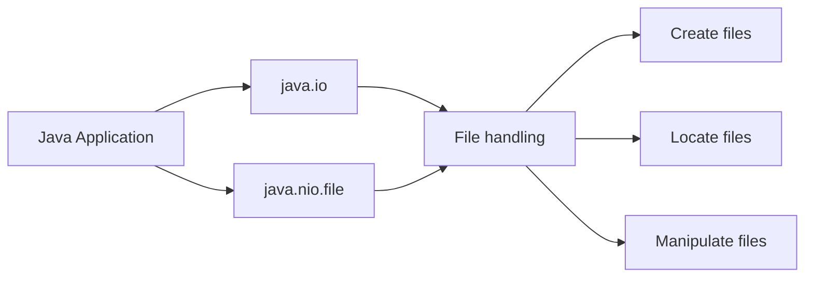
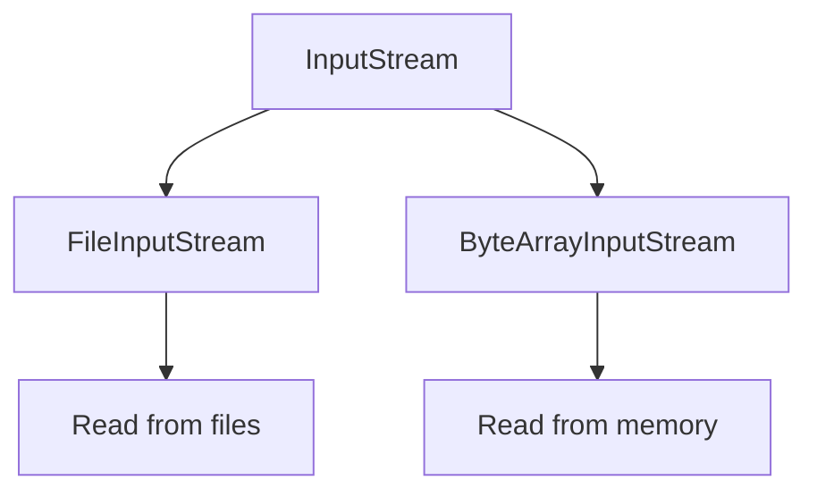
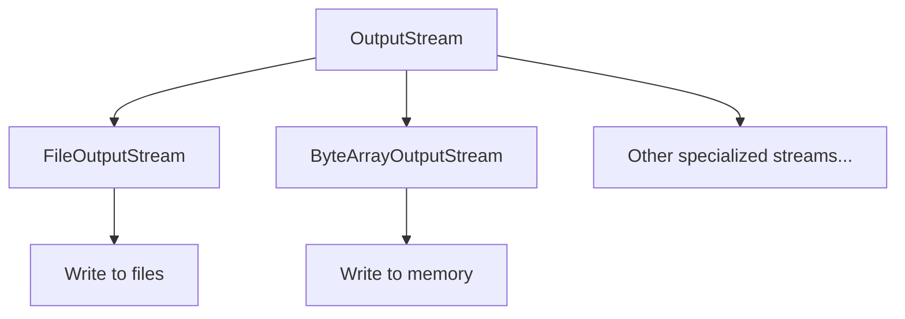
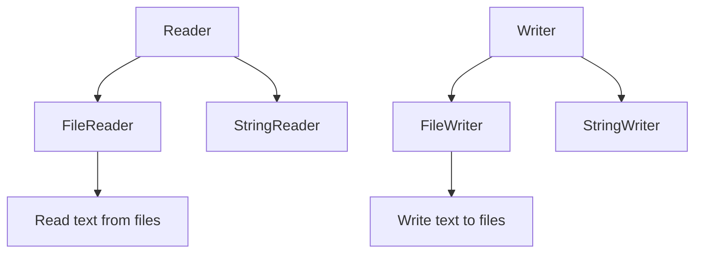
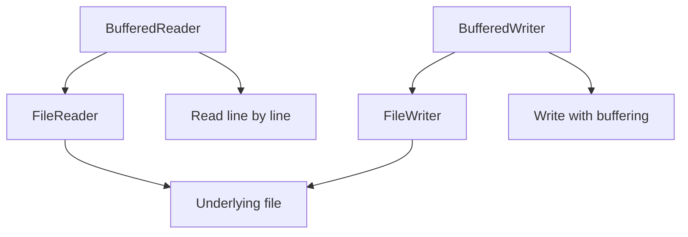
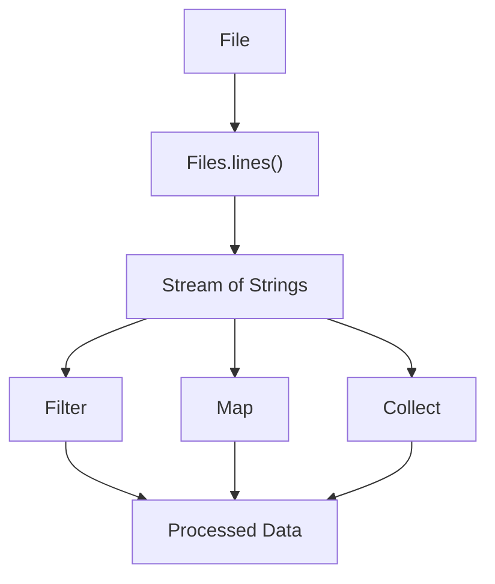

# Java I/O Lab

This lab introduces you to Java Input/Output (I/O) operations, covering file handling, reading, writing, and using streams.

---

## Agenda

1.  [Project Setup](#1-project-setup)
2.  [Creating and Locating Files](#2-creating-and-locating-files)
3.  [Reading with Input Streams](#3-reading-with-input-streams)
4.  [Writing with Output Streams](#4-writing-with-output-streams)
5.  [Character-based I/O with Readers and Writers](#5-character-based-io-with-readers-and-writers)
6.  [Buffered I/O Operations](#6-buffered-io-operations)
7.  [Introduction to File I/O with Streams](#7-introduction-to-file-io-with-streams)

---

## 1. Project Setup

Before you begin, create the necessary project structure:

1.  **Create a Package:** Inside the `src` folder of your project, create a new package named `ie.atu.iolab`. This helps organize your code.
2.  **Create a `Main` Class:** Within the `ie.atu.iolab` package, create a new Java class named `Main`. This class will contain your `main` method.
3.  **Create a `resources` Folder:** *At the same level as your `src` folder* (i.e., in the project's root directory), create a new folder named `resources`. This is where you'll store text files used in the lab. **Important:** Do *not* create the `resources` folder inside the `src` folder.
4.  **Add a test print:** Add to the main method to ensure your environment is setup:

    ```java
    package ie.atu.iolab;

    public class Main {
        public static void main(String[] args) {
            System.out.println("Java I/O Lab Setup Complete!");
        }
    }
    ```
5.  **Run the `Main` Class:** Run your `Main` class. You should see "Java I/O Lab Setup Complete!" printed in the console. This confirms your project is set up correctly.

---

## 2. Creating and Locating Files

### Concept Introduction

(Same as before - Mermaid diagram and explanation are good)



### Code Example (Same as before)

```java
package ie.atu.iolab;

import java.nio.file.Path;
import java.nio.file.Paths;
import java.nio.file.Files;

public class Main {
    public static void main(String[] args) {
        Path projectRoot = Paths.get(System.getProperty("user.dir"));
        Path inputFilePath = projectRoot.resolve("resources").resolve("input.txt");

        if (Files.exists(inputFilePath)) {
            System.out.println("input.txt found at: " + inputFilePath.toAbsolutePath());
        } else {
            System.out.println("input.txt not found at: " + inputFilePath.toAbsolutePath());
        }
    }
}
```

<details>
<summary>Expected Output (File Found)</summary>

```
input.txt found at: /path/to/your/project/JavaIOLab/resources/input.txt
```
*Note: The exact path will depend on your project location.*
</details>

<details>
<summary>Expected Output (File Not Found)</summary>

```
input.txt not found at: /path/to/your/project/JavaIOLab/resources/input.txt
```
*Note: The exact path will depend on your project location.*
</details>

### DIY Task

1.  **Create `input.txt`:** In the `resources` folder, create a new text file named `input.txt`.
2.  **Add Content:** Add the line "Hello, Java I/O!" to `input.txt`.
3.  **Modify the Code:**  Change the code to check for and print the path of a file named `output.txt` *instead* of `input.txt`.  *Do not create `output.txt` yet*.
4.  **Run and Observe:** Run the program.  The output should indicate that `output.txt` is *not* found.
5.  **Create `output.txt`:** Now, create an empty `output.txt` file in the `resources` folder.
6. **Run Again:** Run the program again.  This time, it should find and print the path to `output.txt`.

---

## 3. Reading with Input Streams

### Concept Introduction (Same as before)



### Code Example (Same as before)

```java
package ie.atu.iolab;

import java.io.FileInputStream;
import java.io.IOException;
import java.io.FileNotFoundException;

public class Main {
    public static void main(String[] args) {
        String filePath = "resources/input.txt";
        FileInputStream fis = null;

        try {
            fis = new FileInputStream(filePath);
            int data;
            int charCount = 0;
            while ((data = fis.read()) != -1) {
                System.out.print((char) data);
                charCount++;
            }
            System.out.println("\nTotal characters: " + charCount);

        } catch (FileNotFoundException e) {
            System.err.println("File not found: " + e.getMessage());
        } catch (IOException e) {
            System.err.println("Error reading file: " + e.getMessage());
        } finally {
            try {
                if (fis != null) {
                    fis.close();
                }
            } catch (IOException e) {
                System.err.println("Error closing file: " + e.getMessage());
            }
        }
    }
}
```

<details>
<summary>Expected Output (with "Hello, Java I/O!" in input.txt)</summary>

```
Hello, Java I/O!
Total characters: 16
```
</details>

### DIY Task

1.  **Start with the Example:**  Copy the example code into your `Main` class.
2.  **Modify `input.txt`:**  Change the content of `input.txt` to "This is a different test string.".  Save the file.
3.  **Modify the Code:**  *Without changing the file reading logic*, modify the program to print the number of *bytes* read, in addition to the characters.  The number of bytes read should be the same as the character count in this case (because we're using ASCII characters).  Add a separate print statement for the byte count.
4. **Run and Verify:** Run your program. Verify that it prints the new content of `input.txt` and that the character count and byte count are both correct and equal.

<details>
<summary>Expected Output (After DIY Task)</summary>

```
This is a different test string.
Total characters: 32
Total bytes: 32
```
*Note:  Your output messages might be slightly different, but the counts should be 32.*
</details>

---

## 4. Writing with Output Streams

### Concept Introduction (Same as before)



### Code Example (Same as before)

```java
package ie.atu.iolab;

import java.io.FileInputStream;
import java.io.FileOutputStream;
import java.io.IOException;

public class Main {
    public static void main(String[] args) {
        String inputPath = "resources/input.txt";
        String outputPath = "resources/output.txt";

        try (FileInputStream fis = new FileInputStream(inputPath);
             FileOutputStream fos = new FileOutputStream(outputPath)) {

            int data;
            while ((data = fis.read()) != -1) {
                fos.write(Character.toUpperCase((char)data));
            }
            System.out.println("File copied successfully.");

        } catch (IOException e) {
            System.err.println("Error copying file: " + e.getMessage());
        }
    }
}
```

<details>
<summary>Expected Output</summary>
File copied successfully.
</details>

### DIY Task

1.  **Start with the Example:** Copy the example code into your `Main` class.
2.  **Modify `input.txt`:** Change the content of `input.txt` to "write THIS to output.txt".
3.  **Modify the Code:** Instead of converting the *entire* input to uppercase, modify the code to write only the characters 'T', 'H', 'I', and 'S' (from the word "THIS") in uppercase to `output.txt`.  All other characters should be written in lowercase.
4.  **Run and Verify:** Run your program. Check the content of `output.txt`.

<details>
<summary>Expected Output (Console)</summary>
File copied successfully.
</details>
<details>
<summary>Expected Content of output.txt</summary>
wriTE THIS To ouTPuT.TxT
</details>

---

## 5. Character-based I/O with Readers and Writers

### Concept Introduction (Same as before)

### Code Example (Slightly Modified - Removed vowel counting for clarity in the initial example)

```java
package ie.atu.iolab;

import java.io.FileReader;
import java.io.FileWriter;
import java.io.IOException;

public class Main {
    public static void main(String[] args) {
        String inputPath = "resources/input.txt";
        String outputPath = "resources/output.txt";

        try (FileReader reader = new FileReader(inputPath);
             FileWriter writer = new FileWriter(outputPath)) {

            int character;
            while ((character = reader.read()) != -1) {
                writer.write(character); // Write the character directly
            }
            System.out.println("File copied successfully.");

        } catch (IOException e) {
            System.err.println("Error processing file: " + e.getMessage());
        }
    }
}
```

<details>
<summary>Expected Output (Console)</summary>
File copied successfully.
</details>

### DIY Task

1.  **Start with the Example:**  Copy the *modified* example code (the one without vowel counting) into your `Main` class.  This example simply copies the file using `FileReader` and `FileWriter`.
2.  **Modify `input.txt`:** Change the content of `input.txt` to "Readers and Writers are cool!".
3.  **Modify the Code:** Modify the program to *reverse* the content of `input.txt` and write the reversed string to `output.txt`.  You'll need to store the characters as you read them, and then write them in reverse order.  (Hint:  A `StringBuilder` is very useful for this.)
4. **Run and Verify**: Check the contents of `output.txt`

<details>
<summary>Expected Content of output.txt</summary>
!looc era sretirW dna sraedeR
</details>

---

## 6. Buffered I/O Operations

### Concept Introduction (Same as before)


### Code Example (Same as before)

```java
package ie.atu.iolab;

import java.io.BufferedReader;
import java.io.BufferedWriter;
import java.io.FileReader;
import java.io.FileWriter;
import java.io.IOException;

public class Main {
    public static void main(String[] args) {
        String inputPath = "resources/input.txt";
        String outputPath = "resources/output.txt";

        try (BufferedReader reader = new BufferedReader(new FileReader(inputPath));
             BufferedWriter writer = new BufferedWriter(new FileWriter(outputPath))) {

            String line;
            while ((line = reader.readLine()) != null) {
                writer.write(line.toUpperCase());
                writer.newLine();
            }
            System.out.println("File processed with buffered I/O.");
        } catch (IOException e) {
            System.err.println("Error processing file: " + e.getMessage());
        }
    }
}
```
<details>
<summary>Expected Output (Console)</summary>

```
File processed with buffered I/O.
```
</details>

### DIY Task

1.  **Start with the Example:** Copy the example code into your `Main` class.
2.  **Modify `input.txt`:**  Change the content of `input.txt` to:
    ```
    This is the first line.
    This is the second line.
    And this is the third.
    ```
3.  **Modify the Code:** Modify the program to read the input file line by line, but only write lines that contain the word "second" to `output.txt`.
4. **Run and Verify**: Check `output.txt`

<details>
<summary>Expected Content of output.txt</summary>

```
THIS IS THE SECOND LINE.
```
</details>

---

## 7. Introduction to File I/O with Streams

### Concept Introduction (Same as before)

### Code Example (Same as before)

```java
package ie.atu.iolab;

import java.io.IOException;
import java.nio.file.Files;
import java.nio.file.Paths;
import java.util.stream.Stream;
import java.util.Arrays;

public class Main {
    public static void main(String[] args) {
        String inputPath = "resources/input.txt";

        // Reading and counting lines
        try (Stream<String> lines = Files.lines(Paths.get(inputPath))) {
            long lineCount = lines.count();
            System.out.println("Number of lines: " + lineCount);
        } catch (IOException e) {
            System.err.println("Error reading file: " + e.getMessage());
        }

        // Reading and processing each line, and counting words
        try (Stream<String> lines = Files.lines(Paths.get(inputPath))) {
           long wordCount = lines
                    .flatMap(line -> Arrays.stream(line.split("\\s+"))) // Split each line into words
                    .count(); // Count the words
            System.out.println("Number of words: " + wordCount);

        } catch (IOException e) {
            System.err.println("Error processing file: " + e.getMessage());
        }
    }
}
```

<details>
<summary>Expected Output (with the three-line input.txt from Section 6)</summary>

```
Number of lines: 3
Number of words: 15
```
</details>

### DIY Task

1.  **Start with the Example:** Copy the example code into your `Main` class.
2.  **Use Previous `input.txt`:** Ensure `input.txt` still contains the three lines from the *previous* section's DIY task (Section 6).
3.  **Modify the Code:** Modify the code to find and print the *longest* word in the file.  You'll need to use a combination of `flatMap`, `max`, and `Comparator.comparingInt(String::length)`.  You may also need to use `.orElse(null)` to handle the case where the file is empty.
4. **Run and Verify**:

<details>
<summary>Expected Output</summary>

```
Number of lines: 3
Number of words: 15
Longest word: second
```
*Note: The "Number of lines" and "Number of words" output should be the same as before.  The "Longest word" is the new part.*
</details>
---

End of Lab
